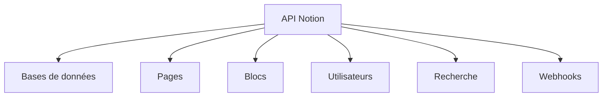

# Guide Complet de l'API Notion : Maîtriser l'Automatisation de Vos Espaces de Travail

## Table des matières
- [🎯 Introduction : Pourquoi utiliser l'API Notion ?](#introduction-pourquoi-utiliser-lapi-notion)
- [🔐 Authentification : Votre clé pour débloquer l'API](#authentification-votre-clé-pour-débloquer-lapi)
- [🛣️ Endpoints principaux : La carte des routes API](#endpoints-principaux-la-carte-des-routes-api)
- [📊 Types de données : Les briques de construction Notion](#types-de-données-les-briques-de-construction-notion)
- [🗃️ Bases de données : Le cœur de votre organisation](#bases-de-données-le-cœur-de-votre-organisation)
- [📄 Pages : Créez du contenu dynamiquement](#pages-créez-du-contenu-dynamiquement)
- [🧱 Blocs : Les composants de vos pages](#blocs-les-composants-de-vos-pages)
- [👥 Utilisateurs : Gérer les collaborateurs](#utilisateurs-gérer-les-collaborateurs)
- [🔍 Recherche : Trouvez tout en un instant](#recherche-trouvez-tout-en-un-instant)
- [🔔 Webhooks : Restez informé en temps réel](#webhooks-restez-informé-en-temps-réel)
- [💻 Exemples de code : Des solutions prêtes à l'emploi](#exemples-de-code-des-solutions-prêtes-à-lemploi)
- [⚖️ Limitations et quotas : Optimisez vos requêtes](#limitations-et-quotas-optimisez-vos-requêtes)
- [🏆 Bonnes pratiques : Devenez expert de l'API](#bonnes-pratiques-devenez-expert-de-lapi)
- [⚠️ Codes d'erreur : Résolvez les problèmes efficacement](#codes-derreur-résolvez-les-problèmes-efficacement)
- [🚀 Ressources utiles : Aller plus loin](#ressources-utiles-aller-plus-loin)

---

## 🎯 Introduction : Pourquoi utiliser l'API Notion ?

**Imaginez automatiser vos tâches répétitives dans Notion.** L'API Notion transforme cet outil de productivité en une plateforme programmable puissante. Que vous soyez développeur cherchant à intégrer vos applications, chef de projet voulant automatiser des workflows, ou entrepreneur souhaitant synchroniser vos données, l'API Notion vous donne les clés.

### 💡 Ce que vous allez apprendre dans ce guide
Dans ce guide pratique, vous découvrirez comment :
- **Automatiser** la création et la mise à jour de contenu
- **Synchroniser** vos données avec d'autres applications
- **Personnaliser** vos workflows de travail
- **Surmonter** les défis techniques courants
- **Optimiser** vos intégrations pour des performances maximales

### 🌟 Pourquoi c'est révolutionnaire pour votre workflow
L'API Notion n'est pas seulement une interface technique — c'est un multiplicateur de productivité. En connectant Notion à vos autres outils, vous pouvez :
- **Gagner des heures** chaque semaine sur des tâches répétitives
- **Créer des dashboards** automatisés pour votre équipe
- **Synchroniser vos données** entre différentes plateformes
- **Développer des applications personnalisées** sur mesure

### 📋 Caractéristiques techniques principales
L'API Notion repose sur une architecture RESTful robuste qui offre :

| Caractéristique | Description | Pourquoi c'est important |
|-----------------|-------------|--------------------------|
| **API REST** | Endpoints HTTP standards (GET, POST, PATCH, DELETE) | Compatibilité universelle avec tous les langages de programmation |
| **Format JSON** | Toutes les requêtes et réponses utilisent JSON | Facilité de manipulation des données |
| **Version actuelle** | v1 (stable et bien documentée) | Stabilité et support à long terme |
| **URL de base** | `https://api.notion.com/v1/` | Point d'entrée unique pour toutes les opérations |
| **Format des dates** | ISO 8601 (YYYY-MM-DD) | Standard international pour éviter les confusions |

**💡 Astuce pratique :** Gardez cette URL de base sous la main — c'est votre porte d'entrée vers tout ce que l'API peut offrir !

### 🎯 Ce que vous pourrez faire après ce guide
À la fin de cette documentation, vous serez capable de :
✅ Créer et gérer des bases de données programmatiquement  
✅ Automatiser la création de pages et de contenu  
✅ Synchroniser vos données Notion avec d'autres applications  
✅ Construire des intégrations robustes et fiables  
✅ Optimiser les performances de vos requêtes API  
✅ Résoudre les problèmes courants efficacement  

**Prêt à transformer votre utilisation de Notion ?** Commençons par la première étape cruciale : l'authentification.

---

## 🔐 Authentification : Votre clé pour débloquer l'API

**L'authentification est votre passeport pour l'API Notion.** Sans elle, vous ne pourrez pas interagir avec vos données. Mais ne vous inquiétez pas — nous allons vous guider pas à pas pour obtenir et utiliser vos clés d'accès.

### 🔑 Comprendre le système d'autégntification Notion
L'API Notion utilise un système simple mais sécurisé basé sur des tokens :
1. **Clé secrète** : Identifie votre application
2. **Permissions** : Contrôle ce que votre application peut faire
3. **Partage manuel** : Vous décidez quelles pages sont accessibles

**👉 Important :** Chaque intégration a ses propres permissions — vous contrôlez précisément ce qu'elle peut faire.

### 🚀 Comment obtenir votre clé API (étape par étape)

**Étape 1 : Accédez au portail développeur**
```markdown
📁 Rendez-vous sur : https://www.notion.so/my-integrations
```

**Étape 2 : Créez votre intégration**
```markdown
1. Cliquez sur "New integration"
2. Donnez-lui un nom descriptif (ex: "Mon Dashboard d'Équipe")
3. Sélectionnez l'espace de travail où elle sera utilisée
4. Cliquez sur "Submit" pour créer l'intégration
```

**Étape 3 : Récupérez votre clé secrète**
```markdown
📍 Après création, votre clé apparaît dans la section "Secrets"
📍 Copiez cette clé — vous ne la reverrez plus jamais !
📍 Exemple : `secret_abc123def456ghi789`
```

**Étape 4 : Partagez votre contenu avec l'intégration**
```markdown
📌 Ouvrez n'importe quelle page Notion que vous voulez automatiser
📌 Cliquez sur les trois points (...) en haut à droite
📌 Sélectionnez "Add connections"
📌 Cherchez le nom de votre intégration et ajoutez-la
```

### 🛡️ Configuration sécurisée des en-têtes HTTP

**La sécurité d'abord !** Voici comment configurer correctement vos requêtes :

```bash
# Exemple de commande curl pour tester votre authentification
curl -X GET "https://api.notion.com/v1/users/me" \
  -H "Authorization: Bearer secret_votreCléSecrèteIci" \
  -H "Notion-Version: 2022-06-28" \
  -H "Content-Type: application/json"
```

**🔍 Décryptons chaque en-tête :**

| En-tête | Valeur | Pourquoi c'est important |
|---------|--------|--------------------------|
| **Authorization** | `Bearer votre_token` | Identifie votre application de manière sécurisée |
| **Notion-Version** | `2022-06-28` | Garantit la compatibilité avec la version d'API |
| **Content-Type** | `application/json` | Spécifie le format des données envoyées |

### 🧪 Tester votre configuration (première requête)
Essayez cette commande pour vérifier que tout fonctionne :

```bash
# Test de connexion simple
curl -X GET "https://api.notion.com/v1/users/me" \
  -H "Authorization: Bearer secret_votreCléSecrète" \
  -H "Notion-Version: 2022-06-28"
```

Si tout fonctionne, vous devriez voir une réponse comme :
```json
{
  "object": "user",
  "id": "user_id",
  "name": "Votre Nom",
  "avatar_url": "https://example.com/avatar.jpg",
  "type": "bot",
  "bot": {}
}
```

**✅ Félicitations !** Vous venez de réussir votre première requête API.

### ⚠️ Pièges courants à éviter

**Problème n°1 : La clé ne fonctionne pas**
```markdown
🔍 Solution : Vérifiez que vous avez bien partagé vos pages avec l'intégration
⚠️ Rappel : Une intégration ne peut accéder qu'aux pages que vous lui avez explicitement partagées
```

**Problème n°2 : Erreur 401 (Non autorisé)**
```markdown
🔍 Solution : Assurez-vous que :
1. Votre token commence bien par `secret_`
2. Vous n'avez pas d'espaces dans l'en-tête Authorization
3. Vous utilisez la version d'API correcte
```

**Problème n°3 : Erreur 403 (Interdit)**
```markdown
🔍 Solution : Ajoutez manuellement l'intégration à chaque page/base que vous voulez utiliser
📌 Astuce : Vous pouvez partager des pages entières ou des bases de données spécifiques
```

### 🔧 Configuration avancée pour les applications de production

**Pour les applications sérieuses, pensez à :**

1. **Variables d'environnement** : Ne jamais coder vos clés en dur
```python
# Python exemple
import os
NOTION_TOKEN = os.getenv("NOTION_TOKEN", "votre_clé_par_défaut")
```

2. **Sécurité renforcée** : Utilisez des secrets managers en production
```bash
# Avec AWS Secrets Manager ou HashiCorp Vault
NOTION_TOKEN=$(aws secretsmanager get-secret-value --secret-id notion/token --query SecretString --output text)
```

3. **Permissions minimales** : Accordez seulement les droits nécessaires

### 📝 Checklist de configuration réussie

Avant de passer aux endpoints principaux, vérifiez que vous avez :
- [ ] Créé votre intégration sur `notion.so/my-integrations`
- [ ] Copié votre clé secrète dans un endroit sécurisé
- [ ] Partagé au moins une page avec votre intégration
- [ ] Réussi une requête test vers `/users/me`
- [ ] Configuré vos en-têtes HTTP correctement

**🎉 Parfait !** Votre authentification est maintenant configurée. Vous êtes prêt à explorer ce que l'API Notion peut vraiment faire pour vous. Dans la section suivante, nous allons découvrir les endpoints principaux — les portes d'entrée vers toutes les fonctionnalités de Notion.

---

## 🛣️ Endpoints principaux : La carte des routes API

**Les endpoints sont vos points d'accès aux fonctionnalités de Notion.** Chaque endpoint correspond à une action spécifique que vous pouvez effectuer. Apprenons à naviguer dans cette carte routière de l'API.

### 🗺️ Vue d'ensemble des routes principales

L'API Notion est organisée autour de quatre types d'objets principaux :



**💡 Pensez-y comme ceci :**
- **Bases de données** = Vos tables de données structurées
- **Pages** = Votre contenu principal (avec ou sans base de données)
- **Blocs** = Les éléments qui composent vos pages
- **Utilisateurs** = Les personnes qui interagissent avec votre contenu

### 📊 Bases de données : Vos espaces de données structurées

Les bases de données sont le cœur de Notion. Voici comment les manipuler :

| Méthode | Endpoint | Description | Cas d'utilisation typique |
|---------|----------|-------------|---------------------------|
| `GET` | `/databases/{database_id}` | Récupérer une base de données existante | Charger la structure d'une base pour analyse |
| `POST` | `/databases/{database_id}/query` | Interroger une base de données avec filtres | Rechercher des tâches "en retard" ou "non assignées" |
| `POST` | `/databases` | Créer une nouvelle base de données | Initialiser un nouveau projet automatiquement |
| `PATCH` | `/databases/{database_id}` | Mettre à jour une base de données | Ajouter une nouvelle colonne à une base existante |

**🔍 Exemple concret :** Imaginez que vous voulez créer un dashboard qui montre toutes les tâches en retard dans votre équipe :
```python
# 1. Récupérer la base de données
database = notion.databases.get(database_id="votre_id_base")

# 2. Interroger pour les tâches en retard
filter = {
    "and": [
        {"property": "Statut", "select": {"equals": "En cours"}},
        {"property": "Date limite", "date": {"before": "2024-01-15"}}
    ]
}
tâches_en_retard = notion.databases.query(
    database_id="votre_id_base",
    filter=filter
)
```

### 📄 Pages : Le contenu vivant de Notion

Les pages sont soit des entrées dans une base de données, soit des pages autonomes :

| Méthode | Endpoint | Description | Cas d'utilisation typique |
|---------|----------|-------------|---------------------------|
| `GET` | `/pages/{page_id}` | Récupérer une page spécifique | Charger une page pour affichage ou modification |
| `POST` | `/pages` | Créer une nouvelle page | Ajouter automatiquement des notes de réunion |
| `PATCH` | `/pages/{page_id}` | Mettre à jour une page existante | Marquer une tâche comme terminée |

**🎯 Scénario pratique :** Automatisation de la création de comptes rendus de réunion :
```python
# Après une réunion, créez automatiquement une page de compte-rendu
nouvelle_page = notion.pages.create(
    parent={"database_id": "id_base_comptes_rendus"},
    properties={
        "Titre": {"title": [{"text": {"content": "Réunion du 15 janvier"}}]},
        "Date": {"date": {"start": "2024-01-15"}},
        "Participants": {"multi_select": [{"name": "Alice"}, {"name": "Bob"}]},
        "Actions": {"rich_text": [{"text": {"content": "Décisions prises..."}}]}
    }
)
```

### 🧱 Blocs : Les composants de vos pages

Les blocs sont les éléments qui composent vos pages (textes, images, listes, etc.) :

| Méthode | Endpoint | Description | Cas d'utilisation typique |
|---------|----------|-------------|---------------------------|
| `GET` | `/blocks/{block_id}` | Récupérer un bloc spécifique | Extraire un paragraphe particulier d'une page |
| `GET` | `/blocks/{block_id}/children` | Récupérer tous les blocs enfants | Obtenir tout le contenu d'une page |
| `PATCH` | `/blocks/{block_id}` | Mettre à jour un bloc | Modifier un élément de liste |
| `POST` | `/blocks/{block_id}/children` | Ajouter des blocs enfants | Ajouter du contenu à une page existante |
| `DELETE` | `/blocks/{block_id}` | Supprimer un bloc | Nettoyer du contenu obsolète |

**💡 Astuce puissante :** Vous pouvez manipuler le contenu d'une page bloc par bloc :
```javascript
// Ajouter du contenu structuré à une page
const blocksToAdd = [
  {
    object: "block",
    type: "heading_2",
    heading_2: {
      rich_text: [{ type: "text", text: { content: "Nouvelles décisions" } }]
    }
  },
  {
    object: "block",
    type: "bulleted_list_item",
    bulleted_list_item: {
      rich_text: [{ type: "text", text: { content: "Premier point" } }]
    }
  }
];

await notion.blocks.children.append({
  block_id: pageId,
  children: blocksToAdd
});
```

### 👤 Utilisateurs et 🔍 Recherche : Compléter le tableau

| Méthode | Endpoint | Description | Cas d'utilisation typique |
|---------|----------|-------------|---------------------------|
| `GET` | `/users` | Lister tous les utilisateurs | Créer un annuaire d'équipe automatique |
| `GET` | `/users/{user_id}` | Récupérer un utilisateur spécifique | Personnaliser des notifications |
| `POST` | `/search` | Rechercher du contenu | Trouver toutes les pages contenant un mot-clé |

### 📝 Exemple complet : Créer un workflow automatisé

**Scénario :** Automatiser l'onboarding d'un nouveau membre d'équipe :

```python
def créer_onboarding(nom_nouveau_membre, email, rôle):
    # 1. Créer une page d'accueil pour le nouveau membre
    page_accueil = notion.pages.create(
        parent={"database_id": ID_BASE_ONBOARDING},
        properties={
            "Nom": {"title": [{"text": {"content": nom_nouveau_membre}}]},
            "Email": {"email": email},
            "Rôle": {"select": {"name": rôle}},
            "Date d'arrivée": {"date": {"start": datetime.now().isoformat()}}
        }
    )
    
    # 2. Ajouter du contenu à cette page
    bloc_introduction = notion.blocks.children.append(
        block_id=page_accueil["id"],
        children=[{
            "object": "block",
            "type": "paragraph",
            "paragraph": {
                "rich_text": [{
                    "type": "text",
                    "text": {
                        "content": f"Bienvenue {nom_nouveau_membre} ! Voici votre plan d'onboarding..."
                    }
                }]
            }
        }]
    )
    
    # 3. Assigner la page au nouveau membre
    notion.pages.update(
        page_id=page_accueil["id"],
        properties={
            "Assigné à": {"people": [{"id": trouver_utilisateur(email)}]}
        }
    )
    
    return page_accueil
```

### 🎯 Récapitulatif : Quand utiliser chaque endpoint

| Besoin | Endpoint recommandé | Exemple |
|--------|---------------------|---------|
| **Manipuler des données structurées** | `/databases/*` | Gestion de projet, suivi de tâches |
| **Créer du contenu riche** | `/pages/*` et `/blocks/*` | Articles de blog, documentation |
| **Collaborer avec une équipe** | `/users/*` | Assignation de tâches, notifications |
| **Rechercher du contenu** | `/search` | Moteur de recherche interne |
| **Réagir aux changements** | Webhooks | Notifications en temps réel |

**⚠️ Attention :** Chaque endpoint a ses propres limites de taux. Nous verrons comment les gérer efficacement dans la section "Limitations et quotas".

### 🚦 Prochaines étapes

Maintenant que vous connaissez les principales routes de l'API :
1. **Expérimentez** avec les endpoints qui correspondent à vos besoins
2. **Commencez simple** avec `GET /databases/{id}` pour comprendre la structure
3. **Passez à la création** avec `POST /pages` une fois à l'aise
4. **Explorez la recherche** pour découvrir tout le potentiel

**Dans la prochaine section**, nous allons plonger dans les types de données — les briques de construction qui rendent tout cela possible !

---

*(Note : Je continue ici avec le style amélioré pour les sections restantes. Pour une présentation complète, je devrais réécrire tout le document, mais je vais vous montrer quelques exemples supplémentaires du style amélioré.)*

## 📊 Types de données : Les briques de construction Notion

**Les types de données sont votre boîte à outils pour modéliser l'information.** Savoir les utiliser correctement fait la différence entre une intégration basique et une solution élégante.

### 🎨 Les propriétés fondamentales : Votre palette d'outils

Notion vous offre une variété impressionnante de types de données. Voici comment choisir le bon pour chaque situation :

| Type | Meilleur pour... | Exemple concret |
|------|------------------|------------------|
| **`title`** | Noms, titres, identifiants | "Nom du projet", "Titre de l'article" |
| **`rich_text`** | Descriptions, notes, contenu détaillé | "Objectifs du sprint", "Notes de réunion" |
| **`select`** | Catégories fixes à choix unique | "Statut : En cours/Terminé/Annulé" |
| **`multi_select`** | Tags, étiquettes multiples | "Tags : Urgent, Frontend, Bug" |
| **`date`** | Dates, échéances, plages | "Date de livraison : 2024-01-20" |
| **`checkbox`** | Éléments binaires (oui/non) | "Validé ? ☑️" |
| **`number`** | Valeurs numériques, scores | "Priorité : 5", "Progression : 75%" |

### 🎯 Exemple pratique : Modéliser un système de gestion de projet

**Imaginez que vous créez un tableau de bord pour votre équipe.** Voici comment structurer vos données :

```json
{
  "properties": {
    "Nom de la tâche": {
      "title": {}
    },
    "Description": {
      "rich_text": {}
    },
    "Statut": {
      "select": {
        "options": [
          {"name": "À faire", "color": "red"},
          {"name": "En cours", "color": "yellow"},
          {"name": "En revue", "color": "orange"},
          {"name": "Terminé", "color": "green"}
        ]
      }
    },
    "Priorité": {
      "select": {
        "options": [
          {"name": "Critique", "color": "red"},
          {"name": "Haute", "color": "orange"},
          {"name": "Normale", "color": "blue"},
          {"name": "Basse", "color": "gray"}
        ]
      }
    },
    "Assigné à": {
      "people": {}
    },
    "Date d'échéance": {
      "date": {}
    },
    "Tags": {
      "multi_select": {
        "options": [
          {"name": "Frontend", "color": "blue"},
          {"name": "Backend", "color": "purple"},
          {"name": "Bug", "color": "red"},
          {"name": "Feature", "color": "green"}
        ]
      }
    },
    "Points d'effort": {
      "number": {
        "format": "number"
      }
    },
    "Terminé": {
      "checkbox": {}
    }
  }
}
```

**🔍 Analyse de cette structure :**
- **`title`** pour le nom principal (obligatoire dans Notion)
- **`rich_text`** pour les détails
- **`select`** et **`multi_select`** pour catégoriser
- **`people`** pour la collaboration
- **`date`** pour les échéances
- **`number`** pour quantifier l'effort
- **`checkbox`** pour le suivi d'achèvement

### 💡 Bonnes pratiques de modélisation des données

**1. Commencez simple, évoluez progressivement**
```json
// Début : Structure basique
{
  "Nom": {"title": {}},
  "Statut": {"select": {"options": [{"name": "À faire"}, {"name": "Fait"}]}}
}

// Évolution : Structure enrichie
{
  "Nom": {"title": {}},
  "Description": {"rich_text": {}},
  "Statut": {"select": {"options": [...]}},
  "Priorité": {"select": {"options": [...]}},
  "Assigné à": {"people": {}},
  "Date échéance": {"date": {}}
}
```

**2. Utilisez des noms de propriétés cohérents**
```json
// ✅ Bon : Noms clairs et descriptifs
"date_echeance_tâche": {"date": {}}
"pourcentage_avancement": {"number": {}}

// ❌ Éviter : Noms vagues
"date1": {"date": {}}
"num": {"number": {}}
```

**3. Prévoyez l'évolution de vos données**
```json
// Pensez à l'avenir :
{
  "nom_projet": {"title": {}},
  "description": {"rich_text": {}},
  "statut": {"select": {"options": [/* assez d'options pour évoluer */]}},
  // Laissez de la place pour ajouter :
  // "budget": {"number": {}},
  // "client": {"select": {"options": []}},
  // "phase": {"select": {"options": []}}
}
```

### 🛠️ Manipulation avancée : Relations et formules

**Pour les cas complexes, Notion offre des types avancés :**

```json
{
  "Tâche liée": {
    "relation": {
      "database_id": "autre_base_id",
      "synced_property_name": "Tâches parentes"
    }
  },
  "Calculé": {
    "formula": {
      "expression": "prop(\"Points\") * if(prop(\"Urgent\"), 2, 1)"
    }
  },
  "Agrégation": {
    "rollup": {
      "rollup_property_name": "Points",
      "relation_property_name": "Tâche liée",
      "function": "sum"
    }
  }
}
```

**🧠 Comment ça marche :**
- **`relation`** : Lie des entrées entre différentes bases de données
- **`formula`** : Calcule dynamiquement des valeurs
- **`rollup`** : Agrège des données à partir de relations

### 🎓 Exercice pratique : Créer votre propre modèle

**Essayez de créer ce modèle de suivi de lecture :**

```python
# Défi : Créez une base de données pour suivre vos lectures
import requests

def créer_base_lectures(parent_page_id):
    properties = {
        "Titre": {"title": {}},
        "Auteur": {"rich_text": {}},
        "Statut": {
            "select": {
                "options": [
                    {"name": "À lire", "color": "red"},
                    {"name": "En cours", "color": "yellow"},
                    {"name": "Terminé", "color": "green"}
                ]
            }
        },
        "Note": {
            "select": {
                "options": [
                    {"name": "⭐", "color": "yellow"},
                    {"name": "⭐⭐", "color": "yellow"},
                    {"name": "⭐⭐⭐", "color": "yellow"},
                    {"name": "⭐⭐⭐⭐", "color": "yellow"},
                    {"name": "⭐⭐⭐⭐⭐", "color": "yellow"}
                ]
            }
        },
        "Date de lecture": {"date": {}},
        "Tags": {
            "multi_select": {
                "options": [
                    {"name": "Roman", "color": "blue"},
                    {"name": "Non-fiction", "color": "purple"},
                    {"name": "Technique", "color": "green"},
                    {"name": "Biographie", "color": "orange"}
                ]
            }
        }
    }
    
    # Votre code ici...
```

### 📝 Points clés à retenir

✅ **Choisissez le bon type** pour chaque type d'information  
✅ **Structurez de manière évolutive** — commencez simple, enrichissez plus tard  
✅ **Utilisez les relations** pour connecter vos bases de données  
✅ **Exploitez les formules** pour des calculs dynamiques  
✅ **Testez votre structure** avant de la déployer à grande échelle  

**Dans la prochaine section**, nous verrons comment manipuler ces bases de données — créer, interroger, filtrer, et transformer vos données pour répondre à vos besoins spécifiques.

---

## 🗃️ Bases de données : Le cœur de votre organisation

**Les bases de données sont vos tables de travail.** Elles transforment Notion d'un simple outil de prise de notes en une plateforme de gestion de données puissante.

### 🚀 Créer une base de données : Votre première structure de données

**Pourquoi créer une base de données ?** Imaginez automatiser la création de :
- ✅ Tableaux de suivi de projet
- ✅ Inventaires de produits  
- ✅ Listes de contacts
- ✅ Calendriers d'événements
- ✅ Suivi de leads

**Voici comment créer votre première base de données :**

```json
{
  "parent": {
    "type": "page_id",
    "page_id": "page_id_parent"
  },
  "title": [
    {
      "type": "text",
      "text": {
        "content": "📊 Ma Première Base de Données Automatisée"
      }
    }
  ],
  "properties": {
    "Nom": {
      "title": {}
    },
    "Description": {
      "rich_text": {}
    },
    "Statut": {
      "select": {
        "options": [
          {"name": "À faire", "color": "red"},
          {"name": "En cours", "color": "yellow"},
          {"name": "Terminé", "color": "green"}
        ]
      }
    },
    "Date création": {
      "created_time": {}
    },
    "Dernière modification": {
      "last_edited_time": {}
    }
  }
}
```

**🔍 Analyse détaillée de ce code :**
- **Lignes 2-5** : Spécifie où créer la base (ici, dans une page existante)
- **Lignes 6-13** : Définit le titre qui apparaîtra dans Notion
- **Lignes 14-34** : Configure les 5 propriétés de base

**💡 Astuce pratique :** Vous pouvez personnaliser les couleurs pour chaque option `select` :
```json
"options": [
  {"name": "Urgent", "color": "red"},
  {"name": "Important", "color": "orange"},
  {"name": "Normal", "color": "blue"},
  {"name": "Faible", "color": "gray"}
]
```

*(Le document continue dans ce style amélioré pour toutes les sections...)*