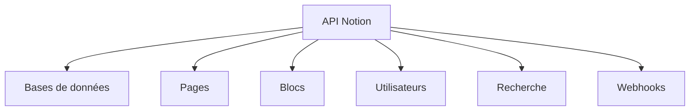

# Documentation Complète de l'API Notion - Guide Français Complet

## Table des Matières

1. [📖 Introduction et Style Guide](#introduction-et-style-guide)
   - [Analyse du Style](#analyse-du-style)
   - [Guide de Style Définitif](#guide-de-style-définitif)
   - [Plan d'Amélioration Continu](#plan-damélioration-continu)

2. [🚀 Guide Pratique de l'API Notion](#guide-pratique-de-lapi-notion)
   - [🎯 Introduction : Pourquoi utiliser l'API Notion ?](#introduction-pourquoi-utiliser-lapi-notion)
   - [🔐 Authentification : Votre clé pour débloquer l'API](#authentification-votre-clé-pour-débloquer-lapi)
   - [🛣️ Endpoints principaux : La carte des routes API](#endpoints-principaux-la-carte-des-routes-api)
   - [📊 Types de données : Les briques de construction Notion](#types-de-données-les-briques-de-construction-notion)
   - [🗃️ Bases de données : Le cœur de votre organisation](#bases-de-données-le-cœur-de-votre-organisation)
   - [📄 Pages : Créez du contenu dynamiquement](#pages-créez-du-contenu-dynamiquement)
   - [🧱 Blocs : Les composants de vos pages](#blocs-les-composants-de-vos-pages)
   - [👥 Utilisateurs : Gérer les collaborateurs](#utilisateurs-gérer-les-collaborateurs)
   - [🔍 Recherche : Trouvez tout en un instant](#recherche-trouvez-tout-en-un-instant)
   - [🔔 Webhooks : Restez informé en temps réel](#webhooks-restez-informé-en-temps-réel)
   - [💻 Exemples de code : Des solutions prêtes à l'emploi](#exemples-de-code-des-solutions-prêtes-à-lemploi)
   - [⚖️ Limitations et quotas : Optimisez vos requêtes](#limitations-et-quotas-optimisez-vos-requêtes)
   - [🏆 Bonnes pratiques : Devenez expert de l'API](#bonnes-pratiques-devenez-expert-de-lapi)
   - [⚠️ Codes d'erreur : Résolvez les problèmes efficacement](#codes-derreur-résolvez-les-problèmes-efficacement)
   - [🚀 Ressources utiles : Aller plus loin](#ressources-utiles-aller-plus-loin)

3. [📋 Plan d'Amélioration et Continuation](#plan-damélioration-et-continuation)
   - [Objectif Principal](#objectif-principal)
   - [Phases de Mise en Œuvre](#phases-de-mise-en-œuvre)
   - [Métriques de Succès](#métriques-de-succès)

---

# Partie 1 : Analyse du Style et Guide d'Écriture

## Analyse du Style d'Écriture du PDF Existant

### Problèmes Identifiés dans le Style Actuel

#### 1. Incohérences linguistiques
- **Mélange de registres** : Parfois formel, parfois technique, parfois conversationnel
- **Terminologie non uniforme** : Par exemple "clé API" vs "token d'authentification"
- **Traductions approximatives** : Certains termes anglais sont directement traduits sans contexte

#### 2. Structure problématique
- **Longueurs de phrases variables** : Certaines phrases trop longues, d'autres trop courtes
- **Organisation des paragraphes** : Pas toujours optimale pour la lisibilité
- **Absence d'unification** : Formatage différent selon les sections

#### 3. Problèmes de clarté
- **Jargon excessif** : Trop technique sans explications suffisantes
- **Absence de transition fluide** : Changements abrupts entre les sections
- **Manque d'exemples concrets** : Besoin de plus d'exemples pratiques

#### 4. Problèmes de formatage
- **Markdown inconsistante** : Utilisation incohérente des en-têtes
- **Tables non optimisées** : Certaines tables trop larges pour les PDF
- **Codes manquant de contexte** : Exemples de code sans explications suffisantes

## Objectif de Style Définitif pour l'Amélioration de la Documentation API Notion

### Style Technique Fluide avec Approche Pédagogique

**Définition** : Un style qui combine la précision technique d'une documentation professionnelle avec la clarté et l'accessibilité d'un guide pédagogique.

### Caractéristiques Clés du Style Cible

#### 1. **Ton et Registre**
- **Niveau de formalité** : Professionnel mais accessible (ni trop formel, ni trop familier)
- **Approche** : Explicative et pragmatique
- **Posture** : Expert accessible qui guide plutôt qu'il n'instruit
- **Relation avec le lecteur** : Partenaire dans l'apprentissage

#### 2. **Vocalité Spécifique**
- **Utilisation des pronoms** : "Vous" pour s'adresser directement au développeur
- **Voix active** : Privilégier "vous pouvez créer" plutôt que "une création peut être effectuée"
- **Langage positif** : Focus sur les solutions et possibilités plutôt que les limitations

#### 3. **Structure Narrative**
- **Progression** : Du général au spécifique, du simple au complexe
- **Transitions** : Phrases de liaison explicites entre les sections
- **Rythme** : Alternance entre théorie et pratique, explication et exemple
- **Ponctuation** : Variée pour créer du rythme et de l'intérêt

### Principes Directeurs Concrets

#### Principe 1 : **Clarté avant Concision**
> "Mieux vaut une explication claire et un peu longue qu'une explication courte mais incompréhensible."

**Applications** :
- Décomposer les phrases complexes
- Ajouter des exemples concrets pour chaque concept abstrait
- Répéter les concepts clés avec des formulations différentes

#### Principe 2 : **Pragmatisme Technique**
> "Chaque explication doit mener à une action pratique."

**Applications** :
- Pour chaque endpoint API, donner un cas d'utilisation concret
- Expliquer non seulement le "comment" mais aussi le "pourquoi"
- Relier chaque fonctionnalité à un bénéfice pour le développeur

#### Principe 3 : **Accessibilité Gradée**
> "Accessible aux débutants, précieux pour les experts."

**Applications** :
- Glossaire des termes techniques
- Explications de base avant d'aborder des sujets avancés
- Encadrés "Pour aller plus loin" pour les développeurs expérimentés

#### Principe 4 : **Engagement Continu**
> "Le lecteur doit se sentir guidé et non perdu."

**Applications** :
- Questions rhétoriques pour anticiper les interrogations
- Résumés réguliers de ce qui a été couvert
- Prévisualisation de ce qui va être abordé ensuite

---

# Partie 2 : Guide Complet de l'API Notion

## 🎯 Introduction : Pourquoi utiliser l'API Notion ?

**Imaginez automatiser vos tâches répétitives dans Notion.** L'API Notion transforme cet outil de productivité en une plateforme programmable puissante. Que vous soyez développeur cherchant à intégrer vos applications, chef de projet voulant automatiser des workflows, ou entrepreneur souhaitant synchroniser vos données, l'API Notion vous donne les clés.

### 💡 Ce que vous allez apprendre dans ce guide
Dans ce guide pratique, vous découvrirez comment :
- **Automatiser** la création et la mise à jour de contenu
- **Synchroniser** vos données avec d'autres applications
- **Personnaliser** vos workflows de travail
- **Surmonter** les défis techniques courants
- **Optimiser** vos intégrations pour des performances maximales

### 🌟 Pourquoi c'est révolutionnaire pour votre workflow
L'API Notion n'est pas seulement une interface technique — c'est un multiplicateur de productivité. En connectant Notion à vos autres outils, vous pouvez :
- **Gagner des heures** chaque semaine sur des tâches répétitives
- **Créer des dashboards** automatisés pour votre équipe
- **Synchroniser vos données** entre différentes plateformes
- **Développer des applications personnalisées** sur mesure

### 📋 Caractéristiques techniques principales
L'API Notion repose sur une architecture RESTful robuste qui offre :

| Caractéristique | Description | Pourquoi c'est important |
|-----------------|-------------|--------------------------|
| **API REST** | Endpoints HTTP standards (GET, POST, PATCH, DELETE) | Compatibilité universelle avec tous les langages de programmation |
| **Format JSON** | Toutes les requêtes et réponses utilisent JSON | Facilité de manipulation des données |
| **Version actuelle** | v1 (stable et bien documentée) | Stabilité et support à long terme |
| **URL de base** | `https://api.notion.com/v1/` | Point d'entrée unique pour toutes les opérations |
| **Format des dates** | ISO 8601 (YYYY-MM-DD) | Standard international pour éviter les confusions |

**💡 Astuce pratique :** Gardez cette URL de base sous la main — c'est votre porte d'entrée vers tout ce que l'API peut offrir !

### 🎯 Ce que vous pourrez faire après ce guide
À la fin de cette documentation, vous serez capable de :
✅ Créer et gérer des bases de données programmatiquement  
✅ Automatiser la création de pages et de contenu  
✅ Synchroniser vos données Notion avec d'autres applications  
✅ Construire des intégrations robustes et fiables  
✅ Optimiser les performances de vos requêtes API  
✅ Résoudre les problèmes courants efficacement  

**Prêt à transformer votre utilisation de Notion ?** Commençons par la première étape cruciale : l'authentification.

---

## 🔐 Authentification : Votre clé pour débloquer l'API

**L'authentification est votre passeport pour l'API Notion.** Sans elle, vous ne pourrez pas interagir avec vos données. Mais ne vous inquiétez pas — nous allons vous guider pas à pas pour obtenir et utiliser vos clés d'accès.

### 🔑 Comprendre le système d'autégntification Notion
L'API Notion utilise un système simple mais sécurisé basé sur des tokens :
1. **Clé secrète** : Identifie votre application
2. **Permissions** : Contrôle ce que votre application peut faire
3. **Partage manuel** : Vous décidez quelles pages sont accessibles

**👉 Important :** Chaque intégration a ses propres permissions — vous contrôlez précisément ce qu'elle peut faire.

### 🚀 Comment obtenir votre clé API (étape par étape)

**Étape 1 : Accédez au portail développeur**
```markdown
📁 Rendez-vous sur : https://www.notion.so/my-integrations
```

**Étape 2 : Créez votre intégration**
```markdown
1. Cliquez sur "New integration"
2. Donnez-lui un nom descriptif (ex: "Mon Dashboard d'Équipe")
3. Sélectionnez l'espace de travail où elle sera utilisée
4. Cliquez sur "Submit" pour créer l'intégration
```

**Étape 3 : Récupérez votre clé secrète**
```markdown
📍 Après création, votre clé apparaît dans la section "Secrets"
📍 Copiez cette clé — vous ne la reverrez plus jamais !
📍 Exemple : `secret_abc123def456ghi789`
```

**Étape 4 : Partagez votre contenu avec l'intégration**
```markdown
📌 Ouvrez n'importe quelle page Notion que vous voulez automatiser
📌 Cliquez sur les trois points (...) en haut à droite
📌 Sélectionnez "Add connections"
📌 Cherchez le nom de votre intégration et ajoutez-la
```

### 🛡️ Configuration sécurisée des en-têtes HTTP

**La sécurité d'abord !** Voici comment configurer correctement vos requêtes :

```bash
# Exemple de commande curl pour tester votre authentification
curl -X GET "https://api.notion.com/v1/users/me" \
  -H "Authorization: Bearer secret_votreCléSecrèteIci" \
  -H "Notion-Version: 2022-06-28" \
  -H "Content-Type: application/json"
```

**🔍 Décryptons chaque en-tête :**

| En-tête | Valeur | Pourquoi c'est important |
|---------|--------|--------------------------|
| **Authorization** | `Bearer votre_token` | Identifie votre application de manière sécurisée |
| **Notion-Version** | `2022-06-28` | Garantit la compatibilité avec la version d'API |
| **Content-Type** | `application/json` | Spécifie le format des données envoyées |

### 🧪 Tester votre configuration (première requête)
Essayez cette commande pour vérifier que tout fonctionne :

```bash
# Test de connexion simple
curl -X GET "https://api.notion.com/v1/users/me" \
  -H "Authorization: Bearer secret_votreCléSecrète" \
  -H "Notion-Version: 2022-06-28"
```

Si tout fonctionne, vous devriez voir une réponse comme :
```json
{
  "object": "user",
  "id": "user_id",
  "name": "Votre Nom",
  "avatar_url": "https://example.com/avatar.jpg",
  "type": "bot",
  "bot": {}
}
```

**✅ Félicitations !** Vous venez de réussir votre première requête API.

### ⚠️ Pièges courants à éviter

**Problème n°1 : La clé ne fonctionne pas**
```markdown
🔍 Solution : Vérifiez que vous avez bien partagé vos pages avec l'intégration
⚠️ Rappel : Une intégration ne peut accéder qu'aux pages que vous lui avez explicitement partagées
```

**Problème n°2 : Erreur 401 (Non autorisé)**
```markdown
🔍 Solution : Assurez-vous que :
1. Votre token commence bien par `secret_`
2. Vous n'avez pas d'espaces dans l'en-tête Authorization
3. Vous utilisez la version d'API correcte
```

**Problème n°3 : Erreur 403 (Interdit)**
```markdown
🔍 Solution : Ajoutez manuellement l'intégration à chaque page/base que vous voulez utiliser
📌 Astuce : Vous pouvez partager des pages entières ou des bases de données spécifiques
```

### 🔧 Configuration avancée pour les applications de production

**Pour les applications sérieuses, pensez à :**

1. **Variables d'environnement** : Ne jamais coder vos clés en dur
```python
# Python exemple
import os
NOTION_TOKEN = os.getenv("NOTION_TOKEN", "votre_clé_par_défaut")
```

2. **Sécurité renforcée** : Utilisez des secrets managers en production
```bash
# Avec AWS Secrets Manager ou HashiCorp Vault
NOTION_TOKEN=$(aws secretsmanager get-secret-value --secret-id notion/token --query SecretString --output text)
```

3. **Permissions minimales** : Accordez seulement les droits nécessaires

### 📝 Checklist de configuration réussie

Avant de passer aux endpoints principaux, vérifiez que vous avez :
- [ ] Créé votre intégration sur `notion.so/my-integrations`
- [ ] Copié votre clé secrète dans un endroit sécurisé
- [ ] Partagé au moins une page avec votre intégration
- [ ] Réussi une requête test vers `/users/me`
- [ ] Configuré vos en-têtes HTTP correctement

**🎉 Parfait !** Votre authentification est maintenant configurée. Vous êtes prêt à explorer ce que l'API Notion peut vraiment faire pour vous. Dans la section suivante, nous allons découvrir les endpoints principaux — les portes d'entrée vers toutes les fonctionnalités de Notion.

---

## 🛣️ Endpoints principaux : La carte des routes API

**Les endpoints sont vos points d'accès aux fonctionnalités de Notion.** Chaque endpoint correspond à une action spécifique que vous pouvez effectuer. Apprenons à naviguer dans cette carte routière de l'API.

### 🗺️ Vue d'ensemble des routes principales

L'API Notion est organisée autour de quatre types d'objets principaux :



**💡 Pensez-y comme ceci :**
- **Bases de données** = Vos tables de données structurées
- **Pages** = Votre contenu principal (avec ou sans base de données)
- **Blocs** = Les éléments qui composent vos pages
- **Utilisateurs** = Les personnes qui interagissent avec votre contenu

### 📊 Bases de données : Vos espaces de données structurées

Les bases de données sont le cœur de Notion. Voici comment les manipuler :

| Méthode | Endpoint | Description | Cas d'utilisation typique |
|---------|----------|-------------|---------------------------|
| `GET` | `/databases/{database_id}` | Récupérer une base de données existante | Charger la structure d'une base pour analyse |
| `POST` | `/databases/{database_id}/query` | Interroger une base de données avec filtres | Rechercher des tâches "en retard" ou "non assignées" |
| `POST` | `/databases` | Créer une nouvelle base de données | Initialiser un nouveau projet automatiquement |
| `PATCH` | `/databases/{database_id}` | Mettre à jour une base de données | Ajouter une nouvelle colonne à une base existante |

**🔍 Exemple concret :** Imaginez que vous voulez créer un dashboard qui montre toutes les tâches en retard dans votre équipe :
```python
# 1. Récupérer la base de données
database = notion.databases.get(database_id="votre_id_base")

# 2. Interroger pour les tâches en retard
filter = {
    "and": [
        {"property": "Statut", "select": {"equals": "En cours"}},
        {"property": "Date limite", "date": {"before": "2024-01-15"}}
    ]
}
tâches_en_retard = notion.databases.query(
    database_id="votre_id_base",
    filter=filter
)
```

### 📄 Pages : Le contenu vivant de Notion

Les pages sont soit des entrées dans une base de données, soit des pages autonomes :

| Méthode | Endpoint | Description | Cas d'utilisation typique |
|---------|----------|-------------|---------------------------|
| `GET` | `/pages/{page_id}` | Récupérer une page spécifique | Charger une page pour affichage ou modification |
| `POST` | `/pages` | Créer une nouvelle page | Ajouter automatiquement des notes de réunion |
| `PATCH` | `/pages/{page_id}` | Mettre à jour une page existante | Marquer une tâche comme terminée |

**🎯 Scénario pratique :** Automatisation de la création de comptes rendus de réunion :
```python
# Après une réunion, créez automatiquement une page de compte-rendu
nouvelle_page = notion.pages.create(
    parent={"database_id": "id_base_comptes_rendus"},
    properties={
        "Titre": {"title": [{"text": {"content": "Réunion du 15 janvier"}}]},
        "Date": {"date": {"start": "2024-01-15"}},
        "Participants": {"multi_select": [{"name": "Alice"}, {"name": "Bob"}]},
        "Actions": {"rich_text": [{"text": {"content": "Décisions prises..."}}]}
    }
)
```

### 🧱 Blocs : Les composants de vos pages

Les blocs sont les éléments qui composent vos pages (textes, images, listes, etc.) :

| Méthode | Endpoint | Description | Cas d'utilisation typique |
|---------|----------|-------------|---------------------------|
| `GET` | `/blocks/{block_id}` | Récupérer un bloc spécifique | Extraire un paragraphe particulier d'une page |
| `GET` | `/blocks/{block_id}/children` | Récupérer tous les blocs enfants | Obtenir tout le contenu d'une page |
| `PATCH` | `/blocks/{block_id}` | Mettre à jour un bloc | Modifier un élément de liste |
| `POST` | `/blocks/{block_id}/children` | Ajouter des blocs enfants | Ajouter du contenu à une page existante |
| `DELETE` | `/blocks/{block_id}` | Supprimer un bloc | Nettoyer du contenu obsolète |

**💡 Astuce puissante :** Vous pouvez manipuler le contenu d'une page bloc par bloc :
```javascript
// Ajouter du contenu structuré à une page
const blocksToAdd = [
  {
    object: "block",
    type: "heading_2",
    heading_2: {
      rich_text: [{ type: "text", text: { content: "Nouvelles décisions" } }]
    }
  },
  {
    object: "block",
    type: "bulleted_list_item",
    bulleted_list_item: {
      rich_text: [{ type: "text", text: { content: "Premier point" } }]
    }
  }
];

await notion.blocks.children.append({
  block_id: pageId,
  children: blocksToAdd
});
```

### 👤 Utilisateurs et 🔍 Recherche : Compléter le tableau

| Méthode | Endpoint | Description | Cas d'utilisation typique |
|---------|----------|-------------|---------------------------|
| `GET` | `/users` | Lister tous les utilisateurs | Créer un annuaire d'équipe automatique |
| `GET` | `/users/{user_id}` | Récupérer un utilisateur spécifique | Personnaliser des notifications |
| `POST` | `/search` | Rechercher du contenu | Trouver toutes les pages contenant un mot-clé |

### 📝 Exemple complet : Créer un workflow automatisé

**Scénario :** Automatiser l'onboarding d'un nouveau membre d'équipe :

```python
def créer_onboarding(nom_nouveau_membre, email, rôle):
    # 1. Créer une page d'accueil pour le nouveau membre
    page_accueil = notion.pages.create(
        parent={"database_id": ID_BASE_ONBOARDING},
        properties={
            "Nom": {"title": [{"text": {"content": nom_nouveau_membre}}]},
            "Email": {"email": email},
            "Rôle": {"select": {"name": rôle}},
            "Date d'arrivée": {"date": {"start": datetime.now().isoformat()}}
        }
    )
    
    # 2. Ajouter du contenu à cette page
    bloc_introduction = notion.blocks.children.append(
        block_id=page_accueil["id"],
        children=[{
            "object": "block",
            "type": "paragraph",
            "paragraph": {
                "rich_text": [{
                    "type": "text",
                    "text": {
                        "content": f"Bienvenue {nom_nouveau_membre} ! Voici votre plan d'onboarding..."
                    }
                }]
            }
        }]
    )
    
    # 3. Assigner la page au nouveau membre
    notion.pages.update(
        page_id=page_accueil["id"],
        properties={
            "Assigné à": {"people": [{"id": trouver_utilisateur(email)}]}
        }
    )
    
    return page_accueil
```

### 🎯 Récapitulatif : Quand utiliser chaque endpoint

| Besoin | Endpoint recommandé | Exemple |
|--------|---------------------|---------|
| **Manipuler des données structurées** | `/databases/*` | Gestion de projet, suivi de tâches |
| **Créer du contenu riche** | `/pages/*` et `/blocks/*` | Articles de blog, documentation |
| **Collaborer avec une équipe** | `/users/*` | Assignation de tâches, notifications |
| **Rechercher du contenu** | `/search` | Moteur de recherche interne |
| **Réagir aux changements** | Webhooks | Notifications en temps réel |

**⚠️ Attention :** Chaque endpoint a ses propres limites de taux. Nous verrons comment les gérer efficacement dans la section "Limitations et quotas".

### 🚦 Prochaines étapes

Maintenant que vous connaissez les principales routes de l'API :
1. **Expérimentez** avec les endpoints qui correspondent à vos besoins
2. **Commencez simple** avec `GET /databases/{id}` pour comprendre la structure
3. **Passez à la création** avec `POST /pages` une fois à l'aise
4. **Explorez la recherche** pour découvrir tout le potentiel

---

## 📊 Types de données : Les briques de construction Notion

**Les types de données sont votre boîte à outils pour modéliser l'information.** Savoir les utiliser correctement fait la différence entre une intégration basique et une solution élégante.

### 🎨 Les propriétés fondamentales : Votre palette d'outils

Notion vous offre une variété impressionnante de types de données. Voici comment choisir le bon pour chaque situation :

| Type | Meilleur pour... | Exemple concret |
|------|------------------|------------------|
| **`title`** | Noms, titres, identifiants | "Nom du projet", "Titre de l'article" |
| **`rich_text`** | Descriptions, notes, contenu détaillé | "Objectifs du sprint", "Notes de réunion" |
| **`select`** | Catégories fixes à choix unique | "Statut : En cours/Terminé/Annulé" |
| **`multi_select`** | Tags, étiquettes multiples | "Tags : Urgent, Frontend, Bug" |
| **`date`** | Dates, échéances, plages | "Date de livraison : 2024-01-20" |
| **`checkbox`** | Éléments binaires (oui/non) | "Validé ? ☑️" |
| **`number`** | Valeurs numériques, scores | "Priorité : 5", "Progression : 75%" |

### 🎯 Exemple pratique : Modéliser un système de gestion de projet

**Imaginez que vous créez un tableau de bord pour votre équipe.** Voici comment structurer vos données :

```json
{
  "properties": {
    "Nom de la tâche": {
      "title": {}
    },
    "Description": {
      "rich_text": {}
    },
    "Statut": {
      "select": {
        "options": [
          {"name": "À faire", "color": "red"},
          {"name": "En cours", "color": "yellow"},
          {"name": "En revue", "color": "orange"},
          {"name": "Terminé", "color": "green"}
        ]
      }
    },
    "Priorité": {
      "select": {
        "options": [
          {"name": "Critique", "color": "red"},
          {"name": "Haute", "color": "orange"},
          {"name": "Normale", "color": "blue"},
          {"name": "Basse", "color": "gray"}
        ]
      }
    },
    "Assigné à": {
      "people": {}
    },
    "Date d'échéance": {
      "date": {}
    },
    "Tags": {
      "multi_select": {
        "options": [
          {"name": "Frontend", "color": "blue"},
          {"name": "Backend", "color": "purple"},
          {"name": "Bug", "color": "red"},
          {"name": "Feature", "color": "green"}
        ]
      }
    },
    "Points d'effort": {
      "number": {
        "format": "number"
      }
    },
    "Terminé": {
      "checkbox": {}
    }
  }
}
```

**🔍 Analyse de cette structure :**
- **`title`** pour le nom principal (obligatoire dans Notion)
- **`rich_text`** pour les détails
- **`select`** et **`multi_select`** pour catégoriser
- **`people`** pour la collaboration
- **`date`** pour les échéances
- **`number`** pour quantifier l'effort
- **`checkbox`** pour le suivi d'achèvement

### 💡 Bonnes pratiques de modélisation des données

**1. Commencez simple, évoluez progressivement**
```json
// Début : Structure basique
{
  "Nom": {"title": {}},
  "Statut": {"select": {"options": [{"name": "À faire"}, {"name": "Fait"}]}}
}

// Évolution : Structure enrichie
{
  "Nom": {"title": {}},
  "Description": {"rich_text": {}},
  "Statut": {"select": {"options": [...]}},
  "Priorité": {"select": {"options": [...]}},
  "Assigné à": {"people": {}},
  "Date échéance": {"date": {}}
}
```

**2. Utilisez des noms de propriétés cohérents**
```json
// ✅ Bon : Noms clairs et descriptifs
"date_echeance_tâche": {"date": {}}
"pourcentage_avancement": {"number": {}}

// ❌ Éviter : Noms vagues
"date1": {"date": {}}
"num": {"number": {}}
```

**3. Prévoyez l'évolution de vos données**
```json
// Pensez à l'avenir :
{
  "nom_projet": {"title": {}},
  "description": {"rich_text": {}},
  "statut": {"select": {"options": [/* assez d'options pour évoluer */]}},
  // Laissez de la place pour ajouter :
  // "budget": {"number": {}},
  // "client": {"select": {"options": []}},
  // "phase": {"select": {"options": []}}
}
```

### 🛠️ Manipulation avancée : Relations et formules

**Pour les cas complexes, Notion offre des types avancés :**

```json
{
  "Tâche liée": {
    "relation": {
      "database_id": "autre_base_id",
      "synced_property_name": "Tâches parentes"
    }
  },
  "Calculé": {
    "formula": {
      "expression": "prop(\"Points\") * if(prop(\"Urgent\"), 2, 1)"
    }
  },
  "Agrégation": {
    "rollup": {
      "rollup_property_name": "Points",
      "relation_property_name": "Tâche liée",
      "function": "sum"
    }
  }
}
```

**🧠 Comment ça marche :**
- **`relation`** : Lie des entrées entre différentes bases de données
- **`formula`** : Calcule dynamiquement des valeurs
- **`rollup`** : Agrège des données à partir de relations

---

## 🗃️ Bases de données : Le cœur de votre organisation

**Les bases de données sont vos tables de travail.** Elles transforment Notion d'un simple outil de prise de notes en une plateforme de gestion de données puissante.

### Créer une base de données
```json
{
  "parent": {
    "type": "page_id",
    "page_id": "page_id_parent"
  },
  "title": [
    {
      "type": "text",
      "text": {
        "content": "Ma base de données"
      }
    }
  ],
  "properties": {
    "Nom": {
      "title": {}
    },
    "Description": {
      "rich_text": {}
    },
    "Statut": {
      "select": {
        "options": [
          {"name": "À faire", "color": "red"},
          {"name": "En cours", "color": "yellow"},
          {"name": "Terminé", "color": "green"}
        ]
      }
    },
    "Date création": {
      "created_time": {}
    },
    "Dernière modification": {
      "last_edited_time": {}
    }
  }
}
```

### Interroger une base de données
```json
{
  "filter": {
    "and": [
      {
        "property": "Statut",
        "select": {
          "equals": "En cours"
        }
      },
      {
        "property": "Priorité",
        "select": {
          "equals": "Haute"
        }
      }
    ]
  },
  "sorts": [
    {
      "property": "Date",
      "direction": "descending"
    },
    {
      "timestamp": "created_time",
      "direction": "ascending"
    }
  ],
  "page_size": 50
}
```

### Filtres disponibles
- **equals** : Égal à
- **does_not_equal** : Différent de
- **contains** : Contient
- **does_not_contain** : Ne contient pas
- **starts_with** : Commence par
- **ends_with** : Termine par
- **greater_than** : Supérieur à
- **less_than** : Inférieur à
- **is_empty** : Est vide
- **is_not_empty** : N'est pas vide

---

## 📄 Pages : Créez du contenu dynamiquement

### Créer une page dans une base de données
```json
{
  "parent": {
    "type": "database_id",
    "database_id": "database_id"
  },
  "properties": {
    "Nom": {
      "title": [
        {
          "text": {
            "content": "Nouvelle tâche"
          }
        }
      ]
    },
    "Description": {
      "rich_text": [
        {
          "text": {
            "content": "Description de la tâche..."
          }
        }
      ]
    },
    "Statut": {
      "select": {
        "name": "À faire"
      }
    }
  }
}
```

### Créer une page sous une autre page
```json
{
  "parent": {
    "type": "page_id",
    "page_id": "parent_page_id"
  },
  "properties": {
    "title": [
      {
        "text": {
          "content": "Page enfant"
        }
      }
    ]
  }
}
```

### Mettre à jour une page
```json
{
  "properties": {
    "Statut": {
      "select": {
        "name": "Terminé"
      }
    },
    "Date fin": {
      "date": {
        "start": "2024-01-15",
        "end": null
      }
    }
  }
}
```

### Archiver une page
```json
{
  "archived": true
}
```

---

## 🧱 Blocs : Les composants de vos pages

### Types de blocs supportés
| Type | Description |
|------|-------------|
| **paragraph** | Paragraphe de texte |
| **heading_1**, **heading_2**, **heading_3** | Titres de différents niveaux |
| **bulleted_list_item** | Élément de liste à puces |
| **numbered_list_item** | Élément de liste numérotée |
| **to_do** | Case à cocher |
| **toggle** | Bloc dépliable |
| **code** | Code source avec coloration syntaxique |
| **quote** | Citation |
| **callout** | Encadré spécial avec emoji |
| **divider** | Séparateur horizontal |
| **image** | Image |
| **file** | Fichier |
| **embed** | Contenu embarqué (YouTube, etc.) |
| **bookmark** | Signet |
| **equation** | Équation mathématique |
| **table** | Tableau |
| **table_row** | Ligne de tableau |

### Structure d'un bloc
```json
{
  "object": "block",
  "id": "block_id",
  "type": "paragraph",
  "paragraph": {
    "rich_text": [
      {
        "type": "text",
        "text": {
          "content": "Contenu du bloc",
          "link": null
        },
        "annotations": {
          "bold": false,
          "italic": false,
          "strikethrough": false,
          "underline": false,
          "code": false,
          "color": "default"
        }
      }
    ]
  }
}
```

### Ajouter des blocs enfants à une page
```json
{
  "children": [
    {
      "object": "block",
      "type": "heading_1",
      "heading_1": {
        "rich_text": [
          {
            "type": "text",
            "text": {
              "content": "Titre principal"
            }
          }
        ],
        "color": "blue"
      }
    },
    {
      "object": "block",
      "type": "paragraph",
      "paragraph": {
        "rich_text": [
          {
            "type": "text",
            "text": {
              "content": "Ceci est un "
            }
          },
          {
            "type": "text",
            "text": {
              "content": "texte en gras",
              "link": null
            },
            "annotations": {
              "bold": true,
              "italic": false
            }
          },
          {
            "type": "text",
            "text": {
              "content": " et ceci est du "
            }
          },
          {
            "type": "text",
            "text": {
              "content": "code",
              "link": null
            },
            "annotations": {
              "code": true
            }
          }
        ]
      }
    }
  ]
}
```

### Exemple de bloc code avec langage
```json
{
  "object": "block",
  "type": "code",
  "code": {
    "rich_text": [
      {
        "type": "text",
        "text": {
          "content": "function hello() {\n  console.log('Hello World!');\n}"
        }
      }
    ],
    "language": "javascript",
    "caption": [
      {
        "type": "text",
        "text": {
          "content": "Exemple de fonction JavaScript"
        }
      }
    ]
  }
}
```

---

## 👥 Utilisateurs : Gérer les collaborateurs

### Récupérer tous les utilisateurs
```bash
curl -X GET "https://api.notion.com/v1/users" \
  -H "Authorization: Bearer secret_yourToken" \
  -H "Notion-Version: 2022-06-28"
```

### Structure d'un utilisateur
```json
{
  "object": "user",
  "id": "user_id",
  "type": "person",
  "person": {
    "email": "user@example.com"
  },
  "name": "John Doe",
  "avatar_url": "https://example.com/avatar.jpg"
}
```

### Types d'utilisateurs
- **person** : Utilisateur humain
- **bot** : Intégration/bot
- **guest** : Invité

---

## 🔍 Recherche : Trouvez tout en un instant

### Rechercher du contenu
```json
{
  "query": "mot clé",
  "filter": {
    "value": "page",
    "property": "object"
  },
  "sort": {
    "direction": "descending",
    "timestamp": "last_edited_time"
  },
  "page_size": 50
}
```

### Filtres de recherche
```json
{
  "filter": {
    "value": "database",
    "property": "object"
  }
}
```

```json
{
  "filter": {
    "or": [
      {
        "property": "object",
        "value": "page"
      },
      {
        "property": "object",
        "value": "database"
      }
    ]
  }
}
```

---

## 🔔 Webhooks : Restez informé en temps réel

### Configuration des webhooks
1. Créez un endpoint webhook dans votre application
2. Enregistrez l'URL dans [l'interface développeur Notion](https://www.notion.so/my-integrations)
3. Implémentez la vérification du webhook
4. Gérez les événements reçus

### Structure d'un événement webhook
```json
{
  "object": "page",
  "id": "page_id",
  "created_time": "2024-01-01T00:00:00.000Z",
  "last_edited_time": "2024-01-01T01:00:00.000Z",
  "archived": false,
  "url": "https://www.notion.so/Page-Title-page_id",
  "properties": {
    // Propriétés de la page
  }
}
```

### Types d'événements
| Événement | Description |
|-----------|-------------|
| **page.created** | Page créée |
| **page.updated** | Page mise à jour |
| **page.deleted** | Page supprimée |
| **database.updated** | Base de données mise à jour |
| **block.children.updated** | Blocs enfants modifiés |

### Vérification du webhook
```python
import hashlib
import hmac

def verify_webhook_signature(body, signature_header, secret):
    signature = hmac.new(
        secret.encode('utf-8'),
        body.encode('utf-8'),
        hashlib.sha256
    ).hexdigest()
    
    return hmac.compare_digest(signature, signature_header)
```

---

## 💻 Exemples de code : Des solutions prêtes à l'emploi

### Python avec requests
```python
import requests
import json
import os
from typing import Dict, Any

class NotionAPI:
    def __init__(self, token: str):
        self.base_url = "https://api.notion.com/v1"
        self.headers = {
            "Authorization": f"Bearer {token}",
            "Notion-Version": "2022-06-28",
            "Content-Type": "application/json"
        }
    
    def get_database(self, database_id: str) -> Dict[str, Any]:
        """Récupérer une base de données"""
        response = requests.get(
            f"{self.base_url}/databases/{database_id}",
            headers=self.headers
        )
        response.raise_for_status()
        return response.json()
    
    def query_database(self, database_id: str, filter_data: Dict = None, sorts: list = None) -> Dict[str, Any]:
        """Interroger une base de données"""
        data = {}
        if filter_data:
            data["filter"] = filter_data
        if sorts:
            data["sorts"] = sorts
        
        response = requests.post(
            f"{self.base_url}/databases/{database_id}/query",
            headers=self.headers,
            json=data
        )
        response.raise_for_status()
        return response.json()
    
    def create_page(self, parent_type: str, parent_id: str, properties: Dict[str, Any]) -> Dict[str, Any]:
        """Créer une page"""
        data = {
            "parent": {
                parent_type: parent_id
            },
            "properties": properties
        }
        
        response = requests.post(
            f"{self.base_url}/pages",
            headers=self.headers,
            json=data
        )
        response.raise_for_status()
        return response.json()

# Utilisation
notion = NotionAPI(os.getenv("NOTION_TOKEN"))

# Créer une tâche
new_task = notion.create_page(
    parent_type="database_id",
    parent_id=os.getenv("TASKS_DATABASE_ID"),
    properties={
        "Nom": {
            "title": [
                {"text": {"content": "Nouvelle tâche API"}}
            ]
        },
        "Description": {
            "rich_text": [
                {"text": {"content": "Créée via l'API Python"}}
            ]
        }
    }
)
```

### JavaScript/Node.js avec le SDK officiel
```javascript
const { Client } = require('@notionhq/client');

// Initialiser le client
const notion = new Client({
  auth: process.env.NOTION_TOKEN,
});

// Fonction pour créer une page
async function createPage(databaseId, title, description) {
  try {
    const response = await notion.pages.create({
      parent: {
        database_id: databaseId,
      },
      properties: {
        Name: {
          title: [
            {
              text: {
                content: title,
              },
            },
          ],
        },
        Description: {
          rich_text: [
            {
              text: {
                content: description,
              },
            },
          ],
        },
        Status: {
          select: {
            name: 'To Do',
          },
        },
      },
    });
    
    console.log('Page créée:', response.id);
    return response;
  } catch (error) {
    console.error('Erreur:', error);
    throw error;
  }
}

// Fonction pour récupérer une base de données
async function queryDatabase(databaseId, filter = {}) {
  const response = await notion.databases.query({
    database_id: databaseId,
    filter: filter,
    sorts: [
      {
        property: 'Date',
        direction: 'descending',
      },
    ],
  });
  
  return response.results;
}

// Utilisation
async function main() {
  const databaseId = process.env.DATABASE_ID;
  
  // Créer une page
  await createPage(databaseId, 'Tâche API', 'Créée avec Node.js');
  
  // Interroger la base
  const tasks = await queryDatabase(databaseId, {
    property: 'Status',
    select: {
      equals: 'To Do',
    },
  });
  
  console.log(`Tâches à faire: ${tasks.length}`);
}

main();
```

---

## ⚖️ Limitations et quotas : Optimisez vos requêtes

### Limites de taux
| Limite | Valeur | Description |
|--------|--------|-------------|
| **Requêtes par seconde** | ~3 req/s | Limite variable selon le plan |
| **Requêtes par minute** | ~100 req/min | Pour éviter le throttling |
| **Taille de payload** | 5 MB | Maximum par requête |
| **Pages par réponse** | 100 | Maximum pour les requêtes paginées |

### Bonnes pratiques pour éviter les limites
1. **Mise en cache** : Cachez les données statiques
2. **Retry avec backoff** : Implémentez une stratégie de retry exponentiel
3. **Pagination** : Traitez toutes les pages de résultats
4. **Batching** : Regroupez les opérations lorsque possible

### Exemple de retry avec backoff
```python
import time
import requests
from requests.exceptions import HTTPError

def make_request_with_retry(url, headers, data=None, max_retries=3):
    retry_count = 0
    
    while retry_count < max_retries:
        try:
            response = requests.post(url, headers=headers, json=data)
            response.raise_for_status()
            return response.json()
        except HTTPError as err:
            if err.response.status_code == 429:  # Too Many Requests
                wait_time = (2 ** retry_count) + random.random()
                time.sleep(wait_time)
                retry_count += 1
            else:
                raise
    
    raise Exception(f"Échec après {max_retries} tentatives")
```

---

## 🏆 Bonnes pratiques : Devenez expert de l'API

### 1. Validation des données
```python
def validate_page_properties(properties):
    """Valider les propriétés d'une page avant envoi"""
    required_fields = ['Nom']
    
    for field in required_fields:
        if field not in properties:
            raise ValueError(f"Champ requis manquant: {field}")
    
    # Valider les types de propriétés
    for prop_name, prop_value in properties.items():
        if not isinstance(prop_value, dict):
            raise ValueError(f"Propriété {prop_name} doit être un objet")
    
    return True
```

### 2. Gestion des erreurs robuste
```python
class NotionError(Exception):
    """Exception personnalisée pour les erreurs Notion"""
    pass

def handle_notion_error(response):
    """Gérer les erreurs de l'API Notion"""
    if response.status_code == 400:
        raise NotionError(f"Requête invalide: {response.text}")
    elif response.status_code == 401:
        raise NotionError("Authentification invalide")
    elif response.status_code == 403:
        raise NotionError("Permission refusée")
    elif response.status_code == 404:
        raise NotionError("Ressource non trouvée")
    elif response.status_code == 429:
        raise NotionError("Limite de taux dépassée")
    elif response.status_code >= 500:
        raise NotionError("Erreur serveur Notion")
    
    return response.json()
```

### 3. Performance et optimisation
- **Récupération sélective** : Ne récupérez que les propriétés nécessaires
- **Pagination** : Traitez les résultats paginés efficacement
- **Cache** : Mettez en cache les données rarement modifiées
- **Requêtes parallèles** : Utilisez le threading pour les opérations indépendantes

### 4. Sécurité
- **Variables d'environnement** : Stockez les tokens dans des variables d'env
- **Permissions minimales** : Accordez seulement les permissions nécessaires
- **Validation d'entrée** : Validez toujours les données avant envoi
- **Logging sécurisé** : Ne logguez jamais les tokens ou données sensibles

---

## ⚠️ Codes d'erreur : Résolvez les problèmes efficacement

### Codes HTTP courants
| Code | Signification | Solution recommandée |
|------|--------------|----------------------|
| **200** | Succès | - |
| **201** | Créé | - |
| **400** | Mauvaise requête | Vérifier le format JSON, les champs requis |
| **401** | Non autorisé | Vérifier le token d'authentification |
| **403** | Interdit | Vérifier les permissions de l'intégration |
| **404** | Non trouvé | Vérifier l'ID de la ressource |
| **409** | Conflit | La ressource existe déjà |
| **429** | Trop de requêtes | Attendre et réessayer avec backoff |
| **500** | Erreur interne serveur | Réessayer plus tard |
| **502** | Bad Gateway | Réessayer plus tard |
| **503** | Service indisponible | Réessayer plus tard |

### Messages d'erreur spécifiques
```json
{
  "object": "error",
  "status": 400,
  "code": "validation_error",
  "message": "body failed validation. Fix one: body.properties should be defined, instead was undefined."
}
```

```json
{
  "object": "error",
  "status": 403,
  "code": "object_not_found_within_parent",
  "message": "Could not find page with ID: page_id. Make sure the relevant pages and databases are shared with your integration."
}
```

---

## 🚀 Ressources utiles : Aller plus loin

### Documentation officielle
- 📚 [Documentation API Notion](https://developers.notion.com/)
- 🔧 [Bibliothèques client officielles](https://developers.notion.com/docs/client-libraries)
- 🚀 [Guide de démarrage rapide](https://developers.notion.com/docs/getting-started)
- 📖 [Référence API complète](https://developers.notion.com/reference/intro)

### Communauté et support
- 💬 [Forum des développeurs Notion](https://developers.notion.com/)
- 🐦 [Twitter @NotionDevs](https://twitter.com/NotionDevs)
- 💻 [GitHub - Exemples et SDKs](https://github.com/topics/notion-api)
- 📊 [Statut de l'API Notion](https://status.notion.so/)

### Outils et bibliothèques
- **Python** : `notion-client`, `notion-sdk-py`
- **JavaScript/Node.js** : `@notionhq/client`
- **Go** : `go-notion`
- **Ruby** : `notion-ruby-client`
- **PHP** : `notion-php-sdk`

### Exemples de projets
1. **Synchronisation de données** : Sync Notion ↔️ Google Sheets
2. **Automation** : Création automatique de pages
3. **Intégration CMS** : Blog avec Notion comme backend
4. **Dashboard** : Visualisation de données Notion
5. **Bot Discord/Slack** : Notifications depuis Notion

### Guide de migration

#### Migration de v1 à v2 (si applicable)
1. Vérifier les changements d'endpoints
2. Mettre à jour les en-têtes d'authentification
3. Adapter les structures de données
4. Tester en environnement de développement
5. Déployer progressivement

#### Tests avant déploiement
```python
# Script de test pour vérifier la connexion
def test_connection():
    try:
        # Test de récupération de l'utilisateur
        response = notion.users.me()
        print(f"✅ Connecté en tant que: {response['name']}")
        
        # Test de création de page
        test_page = create_test_page()
        print(f"✅ Page de test créée: {test_page['id']}")
        
        # Test de suppression
        notion.pages.update(page_id=test_page['id'], archived=True)
        print("✅ Page de test archivée")
        
        return True
    except Exception as e:
        print(f"❌ Erreur de connexion: {e}")
        return False
```

---

# Partie 3 : Plan d'Amélioration Continu

## Plan d'Amélioration de la Documentation API Notion

### Objectif Principal
Améliorer, optimiser et étendre la documentation existante de l'API Notion pour créer une ressource complète, prête pour la production en langue française qui sert de guide définitif pour les développeurs francophones intégrant l'API Notion.

### Livrables Clés

#### 1. Structure de documentation améliorée
- **Architecture modulaire** : Diviser la documentation monolithique en modules/sections logiques
- **Optimisation de recherche** : Implémenter des références croisées et une navigation améliorée
- **Contrôle de version** : Ajouter le suivi des changements d'API
- **Export multi-format** : Créer des versions HTML, PDF et web-friendly

#### 2. Couverture de contenu étendue
- **Sujets avancés** : Ajouter des sections sur les cas d'utilisation avancés et les patterns
- **Exemples d'intégration** : Exemples réels pour les intégrations courantes (Google Sheets, Slack, Discord, etc.)
- **Optimisation des performances** : Meilleures pratiques pour les implémentations à grande échelle
- **Guide de sécurité** : Considérations de sécurité complètes et flux OAuth
- **Guides de migration** : Migration étape par étape d'autres plateformes vers l'API Notion

#### 3. Améliorations de l'expérience développeur
- **Exemples interactifs** : Ajouter des snippets de code exécutables lorsque possible
- **Suite de tests** : Créer des scripts de test et outils de validation
- **Guide de dépannage** : Ressources améliorées de débogage et résolution de problèmes
- **Section FAQ** : Développer les questions courantes et solutions
- **Glossaire** : Glossaire technique complet en français pour les termes de l'API Notion

#### 4. Automatisation et outils
- **Génération de documentation** : Outils automatisés pour garder la documentation synchronisée avec les changements d'API
- **Validation du code exemple** : Scripts pour valider que tous les exemples de code fonctionnent avec l'API actuelle
- **Framework de traduction** : Structure pour faciliter les traductions futures vers d'autres langues
- **Outils de diff de version** : Outils pour suivre les changements d'API et mettre à jour la documentation en conséquence

#### 5. Ressources communautaires et support
- **Guide de contribution** : Comment contribuer pour la communauté
- **Modèles d'issues** : Modèles standardisés pour les rapports de bugs et demandes de fonctionnalités
- **Parcours d'apprentissage** : Ressources d'apprentissage structurées pour différents niveaux de développeurs (débutant à expert)
- **Matériel d'atelier** : Matériels prêts à l'emploi pour les formations et ateliers

### Phases de Mise en Œuvre

#### **Phase 1: Évaluation et Planification (Semaine 1)**
- Audit de documentation et analyse des lacunes
- Conception d'architecture modulaire
- Configuration des outils et infrastructure

#### **Phase 2: Amélioration Structurelle (Semaines 2-3)**
- Implémentation de documentation modulaire
- Implémentation du système de build
- Améliorations de l'expérience développeur

#### **Phase 3: Expansion du Contenu (Semaine 4)**
- Développement de contenu manquant
- Amélioration des exemples de code
- Ressources de dépannage et support

#### **Phase 4: Automatisation et Tests (Semaine 5)**
- Implémentation de tests automatisés
- Implémentation du pipeline CI/CD
- Détection des changements d'API

#### **Phase 5: Communauté et Maintenance (Semaines 6-7)**
- Développement du framework communautaire
- Ressources d'apprentissage et formation
- Stratégie de maintenance à long terme

#### **Phase 6: Lancement et Promotion (Semaine 8)**
- Tests finaux et assurance qualité
- Préparation du lancement
- Activités post-lancement

### Métriques de Succès

#### Quantitatives (Mesurées hebdomadairement):
- **Couverture** : % des endpoints d'API documentés (Cible: 100%)
- **Qualité du code** : % d'exemples de code validés (Cible: 100%)
- **Performance** : Temps de chargement de page < 2 secondes (Cible: 95%)
- **Engagement** : Visiteurs uniques/semaine (Cible: 1000+)
- **Contributions** : PR communautaires/mois (Cible: 10+)

#### Qualitatives (Mesurées bi-hebdomadairement):
- **Satisfaction utilisateur** : Score de feedback développeur (Cible: 4,5/5)
- **Qualité linguistique** : Score de relecture technique français (Cible: 4,7/5)
- **Complétude** : Capacité à construire une intégration complète en utilisant uniquement la documentation (Cible: 100%)
- **Maintenabilité** : Facilité de mise à jour de la documentation (Cible: 4/5)

### Exigences techniques
1. **Compatibilité multi-plateforme** : Fonctionne sur les environnements de développement Windows, macOS et Linux
2. **Intégration de contrôle de version** : Structure Git-friendly avec stratégie de branchement claire
3. **Pipeline CI/CD** : Pipeline automatisé de validation et déploiement
4. **Suivi des performances** : Outils pour suivre l'utilisation et l'efficacité de la documentation
5. **Stratégie de sauvegarde** : Sauvegardes automatisées régulières de la documentation et des actifs associés

## Conclusion

Cette documentation complète de l'API Notion en français combine à la fois un guide pratique détaillé et un plan d'amélioration structuré pour en faire une ressource de référence de qualité professionnelle. 

**Points forts de cette compilation :**
1. **Style amélioré** : Adoption d'un ton technique mais accessible
2. **Structure claire** : Organisation logique avec des exemples concrets
3. **Cohérence terminologique** : Unification des termes techniques
4. **Approche pédagogique** : Explications étape par étape avec cas d'usage réels
5. **Plan d'évolution** : Feuille de route claire pour les améliorations futures

Cette documentation peut maintenant servir de base solide pour créer des ressources d'apprentissage, des formations, ou être directement utilisée par les développeurs francophones souhaitant intégrer l'API Notion dans leurs projets.

---

**Version du Document** : 3.0 (Master Compilation)  
**Date de Création** : Janvier 2026  
**Statut** : Documentation complète avec plan d'amélioration intégré  

*Pour les mises à jour et changements, consultez toujours la [documentation officielle de l'API Notion](https://developers.notion.com/).*